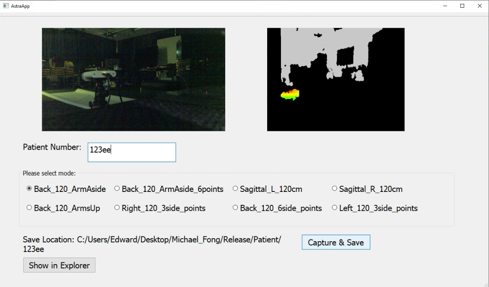

# AstraApp



# Features:
- Live preview
- Save RGB image (.png), depth image (.png), RGB point cloud data (.ply) and point cloud data (.ply)

# Instruction for Development
## 1. Link OpenCV to Visual Studio 2019
1. Project -> DesktopApp Property  
Whether the `Configuration` is `Release` or `Debug` has to match with your installation. For instance, I only installed OpenCV `Release`. Therefore, I must always use `Release`.
2. VC++ Directories:  
`Include Directories` -> edit -> `D:\opencv-4.5.2\build\install\include`  
`Library Directories` -> edit -> `D:\opencv-4.5.2\build\install\x64\vc16\lib`
3. Linker -> Input  
`Additional Dependencies` -> edit -> `D:\opencv-4.5.2\build\install\x64\vc16\lib\*.lib`

- There is only 1 lib if `BUILD_opencv_world` was used when compiling from source.

## 2. Link Qt5 to Visual Studio 2019
1. Extensions -> Manage Extensions  
Install `Qt Visual Studio Tools`.
2. Extensions -> Qt VS Tools -> Qt Versions  
Add an entry and set as default:  
Version: `5.12.11`  
Path: `D:\Qt\Qt5.12.11\5.12.11\msvc2017_64\bin\qmake.exe`
3. Project -> DesktopApp Property -> Qt Project Settings  
Qt Installation = `5.12.11`, which was set in step 2.  
Whether the `Configuration` is `Release` or `Debug` has to match with your installation. For instance, I only installed OpenCV `Release`. Therefore, I must always use `Release`.

## 3. Download necessary tools for Orbbec, and link OrbbecSDK_C_C++_v1.5.7_20230307_7093b5158_win_x64_release to Visual Studio 2019
- For the depth camera Astra+, use OrbbecSDK instead of AstraSDK since AstraSDK maintenance has been stopped.

Please download Orbbec Viewer 1.5, Orbbec SDK 1.5 for Windows and Orbbec Camera Driver for Windows from `https://www.orbbec.com/developers/orbbec-sdk/`:
1. [Orbbec Viewer 1.5](https://dl.orbbec3d.com/dist/orbbecsdk/1.5.7/OrbbecViewer_1.5.7_Windows.zip)
2. [Orbbec SDK 1.5 for Windows](https://dl.orbbec3d.com/dist/orbbecsdk/1.5.7/OrbbecSDK_1.5.7_Windows.zip)
3. [Orbbec Camera Driver for Windows](https://dl.orbbec3d.com/dist/drivers/win32/astra-win32-driver-4.3.0.20.zip)

Then, install the driver, test with Orbbec Viewer and link the SDK for your C++ project.

### Link OrbbecSDK_C_C++_v1.5.7_20230307_7093b5158_win_x64_release to Visual Studio 2019
For both Debug and Release:

VC++ Directories:  
- `Include Directories` -> edit -> add `$(SolutionDir)packages\OrbbecSDK_C_C++_v1.5.7_20230307_7093b5158_win_x64_release\SDK\include`  
- `Library Directories` -> edit -> add `$(SolutionDir)packages\OrbbecSDK_C_C++_v1.5.7_20230307_7093b5158_win_x64_release\SDK\lib`
- Linker -> Input
`Additional Dependencies` -> edit -> add `$(SolutionDir)packages\OrbbecSDK_C_C++_v1.5.7_20230307_7093b5158_win_x64_release\SDK\lib\OrbbecSDK.lib`

## 4. Update the `x64\Debug` or `x64\Release` directory automatically
Run the below command to update the `x64\Debug` directory (automatically) such as adding dll files there.
```
C:\Qt\Qt5.15.2\5.15.2\msvc2019_64\bin\windeployqt.exe C:\Users\Edward\Desktop\Michael_Fong\AstraApp\x64\Debug\AstraApp.exe
```

Similarly, for `x64\Release` directory.
```
C:\Qt\Qt5.15.2\5.15.2\msvc2019_64\bin\windeployqt.exe C:\Users\Edward\Desktop\Michael_Fong\AstraApp\x64\Release\AstraApp.exe
```
